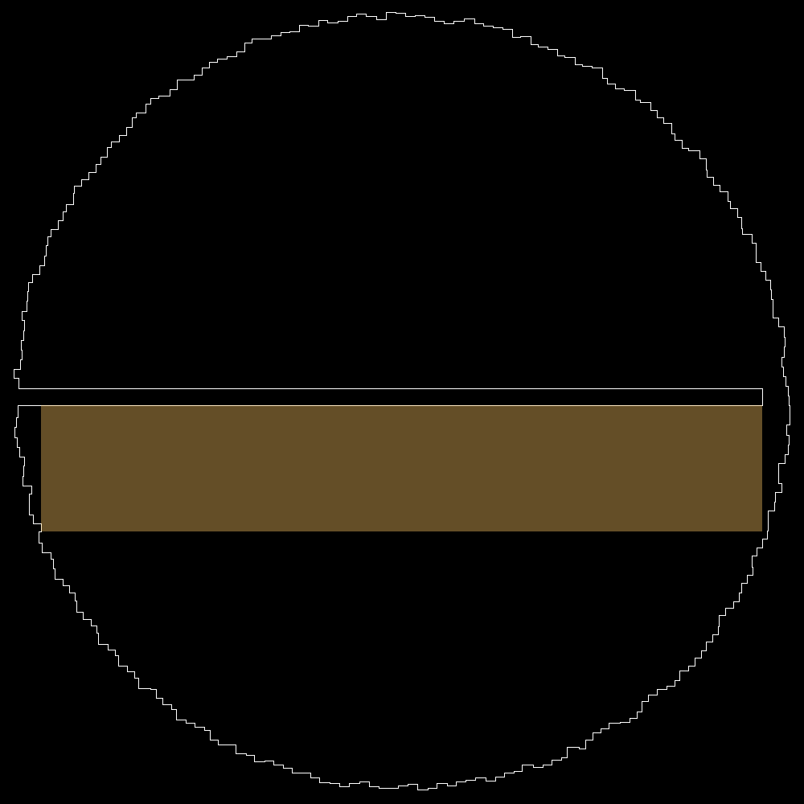
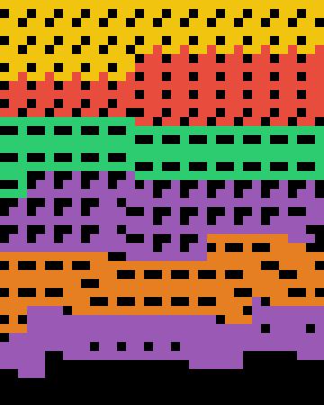

# Advent of Code 2025 in Kotlin

Welcome to the [Advent of Code][aoc] Kotlin project created by [Radiokot][github] using
the [Advent of Code Kotlin Template][template] delivered by JetBrains.

## [Day 1](https://adventofcode.com/2025/day/1)

I decided to simply simulate rotation in a loop.
To keep the dial positive, I used `dial = (100 + dial + direction) % 100`.
Later I learned from the JetBrains stream that the same can be achieved with the `mod` function.
The stream also had an Amper demo, and an impressive Compose visualisation of the rotation.

## [Day 2](https://adventofcode.com/2025/day/2)

For the first part I implemented a string symmetry check.

For the second part I tried splitting a string in same length chunks and then checking if they are the same,
which means the string only consists of repeats of the chunk.
In Kotlin, it's really easy: `if (idString.chunked(length).distinct().size == 1)`
I stumbled upon getting too big count because initially I forgot to break the testing loop,
which counted IDs like `222222` multiple times (`222222` is 2x6 but also 22x3 and 222x2).

## [Day 3](https://adventofcode.com/2025/day/3)

For the first part I wrote loop that tests every possible first digit combining it
with the max digit from what's left to the right. If only had I realized that the testing is pointless,
and you just need to pick the max one too, the second part would have been easier for me.

I spent 1.5 hours implementing a recursive brute-force for the second part
and then hopelessly trying to make it run on the big input lines.
I thought it needed a dynamic programming solution, but since I don't understand it,
I gave up and went to Reddit for a hint.

The hint that helped me with the solution is that if 12 batteries must be enabled,
then the first one must be not closer to the right end of the bank than 11,
and it must be the strongest one obviously.
Then the process is repeated for now remaining 11 batteries to enable,
but now the last enabled battery and all the batteries to its left must be skipped.

## [Day 4](https://adventofcode.com/2025/day/4)

The solution was straightforward, I just programmed what was described in the problem and it worked.
I spent more time on prettifying the file template and utility functions for this solution.
I represented the grid as `List<MutableList<Boolean>>`, and in the cell accessibility check function
I called `getOrNull()` getters to avoid manual checks for going out of range.

I liked how Roman Elizarov used two inline `(-1..1)` loops to count occupied space around a cell,
and then used `<=4` condition instead of `<4` to address counting the cell itself as occupied.
Usually I don't understand his code at all.

Because of the problem being so easy, the JetBrains stream this day was all about Kotlin Notebook,
which I found impressive.

## [Day 5](https://adventofcode.com/2025/day/5)

For the first part I just programmed what was described in the problem:
parse ranges (`LongRange`), then count IDs present in at least one range.

For the second part I initially tried to put all the parsed range values into a set
by doing `flatMapTo(mutableSetOf(), LongRange::toSet)` on `List<LongRange>` –
it was not a big surprise when this didn't work because of the huge range sizes.
Then I decided to create a set of ranges that do not intersect and sum their sizes,
which worked.

How a new range can intersect with the already known ranges from the set, and what to do with it?

1. It can fully cover one or few known ranges – then get rid of these ranges
2. It can start inside a known range – then make it start right after this range
3. It can end inside a known range – then make it end right before this range

If both #2 and #3 are true and point to the same range, this means the new range
is fully inside a known one, in which case the new one is discarded.

Later I learned that this can be easier if the ranges are first sorted by the start,
but I left my solution intact.

## [Day 6](https://adventofcode.com/2025/day/6)

For the first part I transformed the input into an operand matrix and a list of operators.
Then I transposed the operand matrix for convenience – columns became rows
so each individual row now contained operands of the same problem.

For the second part I decided to implement what was described in the problem:
reading the sheet vertically from right to left, figuring out operands of the problem,
finding the operator, computing the problem and moving on.
This didn't work from the first try – I discovered the following caveats:

1. Rows in the input don't have space padding at the end, they are of different length
2. To parse the value read vertically as a number, I needed to do something with spaces in it.
   I initially wanted to remove them with `trim()`, but found out that in the column with the operator
   it is possible to read a value with spaces in between, like `_12__+`, which required special treatment

## [Day 7](https://adventofcode.com/2025/day/7)

Having the experience of the previous year, I know a problem with something doubling in size each iteration
(in this case, a row) is a problem of calculating each iteration considering the result from the previous iteration.
The answer then totals up in the last iteration calculation.

For the first part, I summed up number of spits while calculating through which cells a beam goes each row.

For the second part, I tracked not just a fact of a beam going through a cell, but also how many ways there are
for a beam to reach this cell and if the cell affects number of ways further. A last year caveat I forgot of
was using `Long` when counting rapidly doubling numbers.

## [Day 8](https://adventofcode.com/2025/day/8)

Was it a graph problem? I'm not sure, but I certainly don't want to remember graph algorithms once again,
so it's a relief I didn't have to do this today.

I started by obtaining a sorted list of distances between different points, without duplicates (`A<->B` = `B<->A`).
Did it by comparing all the points to each other.
As for the circuits, decided to store them as sets of points, starting with each point being its own circuit.
Point connection then is a function that finds circuits of both points, glues them together
and replaces the two with the glued one.

Part 1 does the required number of connections between the closest points, 
then returns the requested circuit size product.
Part 2 connects closest points until the glued circuit is big enough (contains all the points),
then returns the requested X coordinate product.

## [Day 9](https://adventofcode.com/2025/day/9)

Geometry problems were hard for me last year, this one was hard too.

For the first part, brute-force solution runs very quick – 
just try all the possible rectangles and find the largest one.

For the second part, the best candidates must be filtered out.
I thought of all the possible corner cases and didn't manage to come up with an inside/outside check
that could satisfy them all. However, when I visualized the input data with `BufferedImage` and `Graphics2D`,
the shape turned out to be quite simple. My friend gave me a clue on how to check coordinates against the perimeter,
and the filter worked after running for about 3 seconds:

1. I checked if any of the rectangle corners is obviously outside the perimeter,
   such rectangles can be filtered out right away;
2. If a rectangle has all their corners inside the perimeter, it still could cross some of the outside area,
   which is the case in the input data.
   I checked if any of the rectangle edges is perpendicularly crossed by the perimeter.

I don't like this solution. Although a star is acquired, I think if the shape wasn't a simple circle
with one straight cut in the middle, my checks wouldn't work or would run for too long.

Roman Elizarov just knew the algorithm for this problem, obviously.
On Reddit, I've seen people getting the right answer
with quite a long-running brute-forces, much longer than 3 seconds.
One guy tried randomly picking some number of points within a rectangle
and checking them for being a perimeter, then assuming the whole rectangle is correct – it worked too.

## [Day 10](https://adventofcode.com/2025/day/10)

For the first part, I wrote a loop that just hits random buttons until the required lights state is reached.
For each machine, this is repeated 100,000 times, so the loop it is very-very likely to find the minimal press count.
I solved some of the last year problems this way, I'm glad it worked here too.

For the second part, I desperately tried to implement a recursive brute-force with memoization and other optimizations,
but nevertheless it only solved 23% of the input.
I doubled down on the brute-force as Roman Elizarov said it was possible,
but apparently I still don't see all the clues therefore unable to optimize it enough.

On Reddit, I read that the problem can be solved as a system of equations, and I did this last year,
but this time the system is not square – number of equations (number of joltages) is less
than the number of variables (press count of each button).

Turned out, there is a math solver called Z3 which takes equations and inequalities and gives you a solution
which satisfies them all. For each machine, I created a system with the following statements:

1. For each joltage, sum of all the presses of buttons affecting this joltage = joltage
2. Each button press count >= 0
3. Each button press count <= min joltage this button affects

There can be many solutions, the solver gives one, but it is not the best one.
To find the best one, I iteratively added more and more "sum of button press counts < previous sum" inequalities
to the system until it is not solvable. The sum from the last solved system is then the minimal one.

## [Day 11](https://adventofcode.com/2025/day/11)

It's a graph problem, and the first part required finding the number of all the possible paths between 2 nodes.
Instead of thinking I just searched for an existing graph algorithm I didn't want to remember earlier.
Found that simple breadth-first search can be modified to track paths instead of individual visited nodes,
implemented it, got the answer.

The second part required what seemed to be the same, but the paths to count needed to contain 2 specific nodes,
and also the start node changed. Change of the start node drastically increased the number of paths to check
causing breadth-first search to choke.

I tried recursive search: 
- The number of problematic paths (containing 2 specific nodes)
  from a given node is a sum of all the problematic paths from its children;
- However, if the given node already is the target, then consider one problematic path found (return 1)
  only if the specific 2 nodes have been encountered, otherwise consider no problematic path found (return 0);
- To track encounters, pass them as a set in the function parameter – the set is initially empty,
  but the given node gets added to it if it is one of the 2 specific nodes.

The mere recursion choked as well, but I was sure it wasn't going to work right away – not until I add memoization.
Turned out that to solve my input, only 1,359 unique path counts from various nodes of the graph must be calculated. 
All the subsequent function calls then can avoid recursion by just returning the already known count.
With memoization, the recursive search works instantly. The answer is huge, takes `Long` to hold it.

I think there must be a way to also solve part 2 in a loop, counting from top to bottom, like in [Day 7](#day-7).
I wonder if Roman Elizarov did just that.

## [Day 12](https://adventofcode.com/2025/day/12)

The last day of this year.

The first part requires you to write a check for if a given rectangle can be filled with a given number
of tetris-like shapes without them overlaps, while shapes can be rotated and flipped. 
At first, I thought this was very tough as I didn't even have an idea of how to place the shapes by hand,
let alone program it. I began with implementing the data parsing, shape rotation and flipping methods.

Turned out this task is prank. The first and the most obvious check is to compare
the area of a rectangle and the area of all the required shapes. If there is not enough space,
filling it is definitely not possible, but if there is – need to check further... but not for this task.
Although the area check doesn't give the right answer on the test data,
it alone is enough to get the correct answer for part 1.

Later I decided to implement a recursive brute-force anyway, it checks all the regions in 2.5 minutes
and indeed gives the same number of valid regions as the simple area check.
This also allowed seeing the placements:

The second part was locked for me as I initially didn't solve the second part of Day 10.
After it was solved, turned out there was no part 2.

[aoc]: https://adventofcode.com

[github]: https://github.com/radiokot

[issues]: https://github.com/kotlin-hands-on/advent-of-code-kotlin-template/issues

[kotlin]: https://kotlinlang.org

[slack]: https://surveys.jetbrains.com/s3/kotlin-slack-sign-up

[template]: https://github.com/kotlin-hands-on/advent-of-code-kotlin-template
